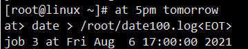
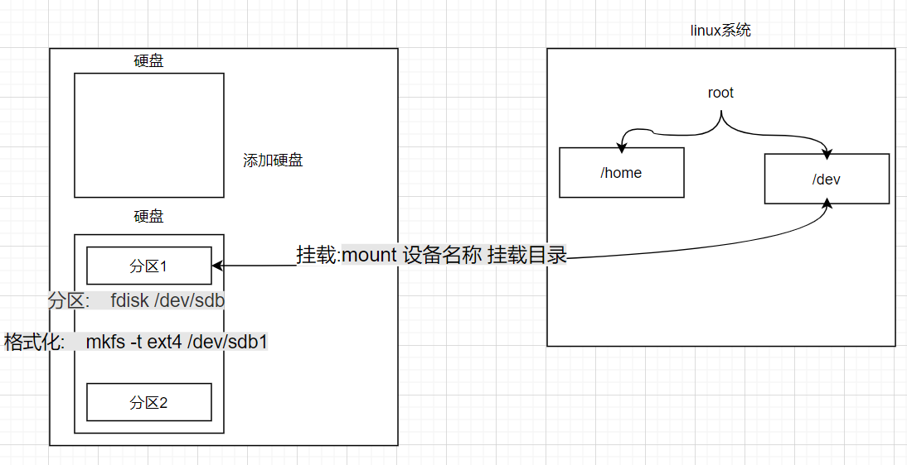

### 虚拟机

虚拟机是通过软件的方式来模拟完整的硬件系统

虚拟机给linux内存分区

boot分区引导分区1G

swap分区交换分区2G

临时充当内存,内存不足的补充机制

root分区根分区17G

为了实现windows系统和linux之间的文件共享，我们需要安装vmtools工具。

目录结构:

目录结构:linux的文件系统是采用级层式的树状目录结构,在此结构中的最上层是**根目录"/"**,然后在此目录下创建其他的目录

**linux系统将计算机的硬件映射为文件,所以linux下一切皆文件**

### 1.文件目录

| 目录        | 内容                                                         |
| ----------- | ------------------------------------------------------------ |
| /bin        | 存放经常使用的命令                                           |
| /sbin       | 存放的是系统管理员使用的系统管理系统                         |
| /home       | 存放普通用户的主目录                                         |
| /root       | 该目录为系统管理员目录,也被称为超级权限者的用户目录          |
| /lib        | 系统开机所需要的最基本的动态连接共享库,几乎所有程序都需要用到这些共享库 |
| /lost+found | 一般情况下为空,当系统非法关机后,这里就存放一些文件           |
| /etc        | 所有的系统管理所需要的**配置文件**和子目录                   |
| /usr        | 存放用户的应用程序和文件                                     |
| /boot       | 存放的是启动linux时使用的一些核心文件,包括一些链接文件以及镜像文件 |
| /tmp        | 存放临时文件                                                 |
| /mnt        | 挂载别的文件系统目录                                         |
| /usr/local  | 额外安装软件的目录                                           |

---

### 2.xshell,xftp6

远程登陆到linux:	因为linux服务器是开发小组共享的,因此需要程序员远程登录到linux进行管理开发

xshell:命令操作

xftp6:传送文件,相较于共享文件夹只能在局域网之间传送文件,使用xftp的可适用的范围更广

---

### 3/vi/vim编辑器

linux系统会内置vi文本编辑器


vim具有程序编辑能力,可以看作是vi的增强版本,可以主动的以字体颜色辨别语法的正确性,方便程序设计.代码补完,编辑及错误跳转


##### 1.正常模式

以vim打开一个文件直接进入正常模式.在这个模式中,可以使用上下左右键来移动光标,可以使用删除字符和删除整行字符来处理文件内容,可以使用复制粘贴快捷键来处理文件数据

1. ###### 拷贝当前行:	`yy`    

   举例:拷贝当前向下的5行,并粘贴(按下p):	`5yy`

2. ###### 删除当前行:    `dd`    

   举例:删除当前行向下的5行:    `5dd`

3. 使用快捷键到达文件最末行[G],到达最首行[gg]

4. 撤销动作:    `u`

##### 2.插入模式

按下i, o, a, r等任何一个字母后进入编辑模式

##### 3.命令行模式

按esc在输入`:`进入这个模式中

1. 命令行下`/关键字`:	回车在文件中查找某个单词.输入n就是查找下一个
2. 命令行下`:set nu`和 `:set nonu`显示文件的行号,隐藏文件的行号.

wq保存退出,q退出,q!强制退出,不保存

---

### 4.关机和重启指令

1. `shutdown -h now` 立刻关机
2. `shutdown -h 1 "hello`1分钟后关机"
3. `shutdown -r now` 现在重新启动计算机
4. `halt` 关机
5. `reboot` 重启计算机
6. `sync` 把内存中的数据同步到磁盘中

1. **不管是重启还是关闭系统,都要先执行sync命令,把内存中的数据写到磁盘中**

---

### 5.用户管理

#### 1.添加用户

`useradd 用户名`

1. 当创建用户成功后,会自动创建和用户同名的家目录,默认该用户的家目录在`/home/用户名`
2. 也可以通过==useradd -d 指定目录 新的用户名==,给新创建的用户指定的家目录

#### 2.指定/修改密码

`passwd 用户名`:	如果不指定用户名,就会给当前用户修改密码

`userdel 用户名`:	删除指定用户,但保留此用户的家目录

`userdel -r 用户名`:	删除用户并删除其家目录

一般情况下,建议保留家目录

#### 3.查看用户信息指令

`id root`

#### 4.切换用户

`su - 用户名`

1. 从权限高的用户切换到权限低的用户,不需要输入密码;反之,需要
2. 当返回到原来的用户时,使用exit或logout指令

`who am i/whoami`查看当前用户

如果使用`su - `切换用户,输出的依旧是第一次登入的用户

1. 登陆时尽量少用root账号登陆,避免操作失误.可以使用普通用户登录,登陆后再用`su - root用户名`命令来切换成系统管理员身份,使用`logout`退回到普通用户,再次输入`logout`退出系统
2. 在提示符下输入`logout`即可注销用户,这个指令在图形运行级别无效,在运行级别有效

---

### 6.用户组

作用:	系统可以对具有共性的多个用户进行统一的管理

#### 1.操作

###### 1.新增组

`groupadd 组名`

###### 2.删除组

`groupdel 组名`	如果组内有用户,就不能删除

###### 3.增加一个用户到指定组里

`useradd -g 用户组 用户名`

**如果添加一个用户时没有指定组,默认会添加一个组(组名就是用户名),相当于指令`useradd wd`加上`groupadd wd`**

###### 4.修改用户的组

`usermod -g 用户组 用户名`	需要更新,就重新登陆

---

#### 2.用户和组相关文件

##### 1./etc/passwd文件

用户(user)的配置文件,记录用户的各种信息

每行的含义:	用户名:口令:用户标识号(uid):组标识号(gid):注释性描述:主目录:登录Shell

**shell作用:解释指令给内核**


##### 2./etc/shadow文件

口令的配置文件

每行的含义:	登录名:加密口令:最后一次修改的时间:最小时间间隔:最大时间间隔:警告时间:不活动时间:失效时间:标志

##### 3./etc/group文件

组(group)的配置文件,记录Linux包含的组的信息

每行的含义:组名:口令:组标识号:组内用户列表

---

#### 3.运行级别

切换运行级别:	`init[运行级别]`

0:	关机

1:	**单用户[找回丢失密码]**

2:	多用户状态没有网络服务

3:	多用户状态有网络服务[常用,不带图形界面]

4:	系统未使用保留给用户

5:	**图形界面**

6:	系统启动

常用运行级别是3和5,也可以指定默认运行级别

---

#### 4.如何找回root密码?

1. 启动系统,进入开机界面,在界面中按'e'进入编辑模式
2. 进入编辑模式,找到`linux16`所在行,在行末尾输入:`init=/bin/sh`表示进入单用户模式
3. 按Ctrl + x进入单用户模式
4. 在光标闪烁的位置输入:`mount -o remount,rw/`,完成后按回车
5. 在新的一行末尾输入:`passwd`,完成后按回车.输入密码,如果出现`passwd....`,说明修改成功
6. 在光标闪烁的位置上输入:`touch /.autorelabel`,完成后按回车
7. 在光标闪烁的位置上输入:`exec /sbin/init`,完成后按回车,等待系统自动修改密码,完成后系统自动重启,新密码生效

---

### 7.常用操作类

#### 1.帮助指令

* man 获取帮助信息

  `man [命令或配置文件]`:	获取帮助信息

* help指令

  `help 命令`:	获得shell内置命令的帮助信息

按空格键向下一页

* `ifconfig`:	查看ip地址

* `reboot`:	重启

---

#### 2.文件目录类

##### 1.ls指令

`ls`:列出当前目录下的所有文件

`ls -a`:	显示所有文件

`ls -l`:	详细信息

`ls -la/s -al`:	显示所有文件的详细信息

`ls -al /root`:	显示指定文件下所有文件的详细信息

`ls -lh`:人性化显示

---

绝对路径:从根目录开始定位

相对路径:从当前目录开始定位

##### 2.pwd指令

`pwd`:显示当前文件的绝对路径

##### 3.cd指令

`cd [参数]`:切换到指定目录

`cd ~`和`cd`:回到自己的家目录

`cd ..`:回到当前目录的上一级目录

##### 4.mkdir指令

`mkdir [选项] 要创建的目录`:	用于创建目录

`mkdir -p 要创建的目录`:	创建多级目录

##### 5.rmdir指令

`rmdir [选项] 要删除的空目录`:	删除空目录

`rm -rf 要删除的目录`:	删除非空目录

##### 6.touch指令

`touch 文件名`:	创建空文件

##### 7.cp指令

`cp [选项] source dest`:	拷贝文件到指定目录

`cp -r source dest`:	递归复制整个文件夹到指定文件夹下

`cp -r source dest`:	如果dest文件夹下有source文件夹中重复的文件,直接覆盖,不用确认

##### 8.rm指令

`rm [选项] 要删除的文件或文件夹`:	移除文件或目录

`rm -r 要删除的文件或文件夹`:	递归删除整个文件夹

`rm -rf 要删除的文件或文件夹`:	强制删除整个文件夹,不提示

##### 9.mv指令

`mv oldNameFile newNameFile`:	如果在同一目录下,就表现为重命名

`mv oldNameFile newNameFile`:	如果不在同一目录下,就表现为移动文件(剪切)

##### 10.cat指令

`cat [选项] 要查看的文件`:	查看文件内容

`cat -n 要查看的文件`:查看文件内容同时显示行号

查看但不能修改,为了浏览方便,一般会带上 管道命令|more

cat 文件|more

##### 11.more指令

`more 要查看的文件`:	查看文件内容

基于vi编辑器的文本过滤器,他以全屏的方式按页显示文本文件的内容

| 操作          | 功能说明                 |
| ------------- | ------------------------ |
| space(空格键) | 向下翻一页               |
| Enter         | 向下翻一行               |
| q             | 退出                     |
| Ctrl + F      | 向下滚动一页             |
| Ctrl + B      | 返回上一页               |
| =             | 输出当前行的行号         |
| :f            | 输出文件名和当前行的行号 |

##### 12.less指令

less指令用来分屏查看文件内容,它的功能与more指令类似,但是比more指令更加强大,支持各种显示终端.less指令在现实文件内容时,并不是依次将整个文件加载之后才显示,而是根据显示需要加载的内容,对于显示大型文件具有较高的效率

| 操作     | 功能说明                              |
| -------- | ------------------------------------- |
| 空格键   | 向下翻一页                            |
| pagedown | 向下翻一页                            |
| pageup   | 向上翻一页                            |
| /字符    | 向下搜索字符 n: 向下查找; N: 向上查找 |
| ?字符    | 向上搜索字符 n: 向上查找; N: 向下查找 |
| q        | 退出                                  |

##### 13.echo指令

输出内容

`echo [选项] [输出内容]`

例: `echo $HOSTNAME`; `echo hello,world`

##### 14.head指令

`head 文件`:	显示文件的开头部分内容,默认情况下显示文件的前10行内容

`head 文件`:	查看文件头10行内容

`head -n 5 文件`:	查看文件头5行内容

##### 15.tail指令

`tail 文件`:	显示文件的末尾部分内容,默认情况下显示文件末尾10行内容

`tail 文件`:	查看文件末尾10行内容

`tail -n 5 文件`:	查看文件末尾5行内容 

##### 16.`>`指令和`>>`指令

`>`:覆盖

`>>`:追加

1. `ls -l` > 文件:	列表的内容写入到文件中
2. `ls al` > 文件:    列表的内容追加到文件末尾
3. `cat 文件1 > 文件2`:    文件1的内容覆盖文件2的内容
4. `echo "内容" >> 文件`:    将内容追加到文件中

##### 17.ln指令

软链接也称为符号链接,类似于windows里的快捷方式,主要存放了链接其他文件的路径

`ln -s [源文件或目录] [软链接名]`:	给源文件创建一个软链接

`rm [链接名]`:	删除链接

##### 18.history指令

`history`:	查看已执行过的所有历史指令

`history 10`:	查看最近的10条历史指令

`!5`:	执行曾经执行过的第五条指令

---

#### 2.时间日期类

##### 1.date指令

###### 1.显示当前日期

注意区分大小写的含义

1. date:	显示当前时间
2. date  "+%Y":     显示当前年份
3. date  "+%m":    显示当前月份
4. date "+%d":    显示当前是哪一天
5. date "+%Y-%m-%d %H:%M%S":    显示年月日时分秒

当后边的参数有空格时,就要加引号,负责不用加

###### 2.设置日期

`date -s "时间"`

---

##### 2.cal指令

`cal`:    显示本月日历

`cal 时间`:	显示本年的日历

---

#### 3.搜索查找类

**如果与目录有关的操作,需要加上`-r`来进行操作**

##### 1.find指令

`find [搜索范围] [选项]`:	将从指定目录项下递归的遍历其各个目录,将满足条件的文件或目录显示在终端

| 选项            | 功能                               |
| --------------- | ---------------------------------- |
| -name<查询方式> | 按照指定的文件名查找模式来查找文件 |
| -user<用户名>   | 查找属于指定用户名的所有文件       |
| -size<文件大小> | 按照指定的文件大小查找文件         |

`find /home -name hello.java`:	在home目录下开始搜索文件名为hello.java的文件

删除`-exec rm -rf {} \;`

`-exec`:	继续执行命令

`{}`:	前边指令得到的内容

`\;`:	结尾符号

---

##### 2.locate指令

locate指令可以快速定位文件路径,locate指令利用事先建立的系统中**所有文件名称及路径的locate数据库**实现快速定位指定的文件.locate指令无需遍历整个文件系统,查询快.为了保证查询结果的准确性,管理员必须定期更新locate时刻

`locate 搜索的文件`

由于locate指令基于数据库进行查询,所以每次运行前,必须使用`updatedb`指令创建locate数据库

##### 3.which指令

`which 指令`:	查看某个指令所在的目录位置

##### 4.grep指令和管道指令(查找)

grep过滤查找,管道符"|",表示将前一个命令的输出结果传递给后边的命令进行处理

`grep [选项] 查找内容 源文件`

| 选项 | 功能                        |
| ---- | --------------------------- |
| -n   | 显示匹配行及行号            |
| -i   | 忽略字母大小写              |
| -v   | 反向匹配,获得不含参数的结果 |

`cat /mnt/hgfs/share/dierzhou/promusic/main.c|grep -n "if"`与

` grep -n "if" /mnt/hgfs/share/dierzhou/promusic/main.c`

效果相同

---

#### 4.压缩和解压类

##### 1.gzip/gunzip指令

gzip用于压缩文件,gunzip用于解压文件

`gzip 文件`:	解压文件,但只能解压.gz结尾的文件

`gunzip 文件.gz`:	解压压缩文件命令

会在源文件基础上进行修改

##### 2.zip/unzip指令

zip用于压缩文件,unzip用于解压文件

`zip [选项] XXX.zip 将要压缩的内容`:	压缩文件和目录

`unzip [选项] XXX.zip`:	解压文件和目录

zip常用选项:	`zip -r XXX.zip`:	递归解压,即压缩目录

unzip常用选项:	`unzip -d<目录>`:	解压后文件的存放目录

不会修改源文件

` zip data.zip data.txt `

` unzip data.zip `

##### 3.tar指令

tar指令是打包指令,最后打包的文件是.tar.gz的文件

`tar [选项] XXX.tar.gz 打包的内容`:	打包目录

选项说明

| 选项 | 功能                                                |
| ---- | --------------------------------------------------- |
| -c   | 产生.tar打包文件(将多个文件合并为一个文件)          |
| -v   | 显示详细信息                                        |
| -f   | 指定压缩后的文件名                                  |
| -z   | .gz文件进行压缩解压,会根据-c/-x来决定是解压还是压缩 |
| -x   | 解包.tar文件                                        |

`tar -zcvf mydierzhou.tar.gz  dierzhou`

`tar -zxvf mydierzhou.tar.gz `

- **tar在打包时，如果打包目标是绝对路径时会出现警告`tar: 从成员名中删除开头的“/”`根本原因是因为打包时会把目录结构打进去，解包时也会把对应的目录结构解出来**
- **通常建议相对路径打包，先cd到目标所在目录**

---

### 8.组

在linux中的每一个用户必须属于一个组,不能独立组外.在linux中每一个文件都有`所有者`,`所在组`,`其他组`的概念

#### 1.文件/目录所有者

一般为文件的创建者,谁创建了这个文件,谁就是这个文件的所有者

##### 1.查看文件的所有者:	`ls -ahl`

##### 2.修改文件所有者:	`chown 用户名 文件名`

---

#### 2.文件/目录所在组

当某个用户创建了一个文件后,这个文件的所在组就是这个用户所在组

##### 1.组的创建

`groupadd 组名`

##### 2.查看文件/目录所在组

`ls -ahl`

##### 3.修改文件所在组

`chgrp 组名 文件名`

---

#### 3.其他组

除文件的所有者和所在组的用户外,系统的其他用户都是文件的其他组

在添加用户时,可以指定将该用户添加到哪个组中,同样的,用root的管理权限可以改变某个用户所在的组

##### 1.改变用户所在组

1.`usermod -g 组名 用户名`

2.改变该用户登陆的初始目录`usermod -d 目录名 用户名`,用户需要有进入到新目录的权限

---

### 9.权限介绍

`-rw-r--r--. a.txt`

#### 1.0~9位说明

1.第0位确定文件类型(d, -, l, c, b)

​	l(link)是链接,相当于windows的快捷方式

​	d(directory)是目录,相当于windows的文件夹

​	c()是字符设备文件,鼠标,键盘

​	b()是块设备,比如硬盘

​	-是普通文件

2.第1~3位确定**该文件的所有者**拥有该文件的权限 --- user

3.第4~6位确定**所属组**拥有该文件的权限 --- group

4.第7~9位确定其他用户拥有该文件的权限 --- other

#### 2.rwx权限

##### 1.rwx作用到文件

###### 1.[r]

[r]代表可读(read):可以读取,查看

###### 2.[w]

[w]代表可写(write):可以修改,但是不代表可以删除该文件,删除一个文件的前提条件是对**该文件所在的目录有写的权限**,才能删除该文件

###### 3.[x]

[x]代表可执行(execute):可以被执行

##### 2.rwx作用到目录

###### 1.[r]

[r]代表可读(read):可以读取,通过`ls`查看目录内容

###### 2.[w]

[w]代表可写(write):可以修改,对目录内创建 + 删除 + 重命名目录

###### 3.[x]

[x]代表可执行(execute):可以进入该目录

---

为什么给目录`[x]`权限可以对其文件夹下的文件聂荣进行修改呢?

**因为修改和删除文件的内容并不会修改文件夹下的文件目录,文件依旧存在不变,只是内容变了**

---

举例:

`-rwxrw-r-- 1 root root 1213 Feb 2 09:39 abc`

第一个字符代表文件类型: `-`代表该文件是普通文件

其余字符每3个一组

第一组`(rwx)`:代表**文件的拥有者**对该文件具有读`r`,写`w`,执行`x`权限

第二组`(rw-)`:代表与**文件拥有者同组的用户**对该文件具有读`r`,写`w`的权限,但没有执行的权力

第三组`(r--)`:代表**不与文件拥有者同组的其他用户**具有读`r`的权限,但没有写和执行的权利

`1`		文件:	硬连接数为`1` 目录:	子目录数为`1`

`root`		所属的用户

`root`		所属的组

`1213`		文件大小(字节大小),如果是文件夹,则会显示4096

`09:39`		文件最后修改时间

`abc`		文件名

---

#### 3.修改权限

`chmod`:	修改文件或目录权限

##### 1.通过` +, -, =`变更权限

`u`:	所有者	`g`:	所在组	`o`:	其他用户	`a`:	所有用户(`u,g,o`的总和)

1.`chmod u=rwx,g=rx,o=x 文件/目录名`

2.`chmod o+w 文件/目录名`

3.`chmod a-x 文件/目录名`

---

举例:

1.给abc文件的所有者读写权限,给所在组读和执行的权限,给其他组读和执行的权限

`chmod u=rw,g=r,o=r abc`

2.给abc文件的所有者除去执行的权限,增加组写的权限

`chmod u-x, g+w abc`

3.给abc文件的所有用户增加读的权限

`chmod a+r abc`

---

##### 2.通过数字变更权限

rwx的数字表示:	`r` = 4,	`w` = 2,	`x` = 1,	`wx` = 3,	`rwx` = 7,	`rx` = 5,	`rw` = 6

`chmod 751 文件/目录`

---

举例:

将a.txt文件的权限修改为`rwxr-xr-x`使用数字的方式实现

`chmod 751 a.txt`

---

#### 4.修改文件所有者

`chown newOwner 文件/目录`:	改变所有者

`chown newOwner:newGroup 文件/目录`	改变所有者和所在组

`-R`:	如果是目录,则使其下所有子文件或目录递归生效

指令 [选项] [参数]

#### 5.修改文件/所在组

`chgrp newGroup 文件/目录`

---

### 10.crond任务调度

任务调度:	是指**系统在某个时间执行特定的命令或程序**

任务调度的分类:	

1. 系统工作:	有些重要的工作必须周而复始地执行,比如病毒扫描
2. 个别用户工作:    个别用户可能希望执行某些程序,比如对mysql数据库的备份

`crontab [选项]`:	进行定时任务的设置

常用选项:

| 选项 | 功能                          |
| ---- | ----------------------------- |
| -e   | 编辑crontab定时任务           |
| -l   | 查询crontab任务               |
| -r   | 删除当前用户所有的crontab任务 |

---

设置任务调度文件:	`/etc/crontab`

设置个人任务调度:	`crontab -e`

输入任务到调度文件

如:	`*/1 * * * * ls -l /etc/ >> /tmp/to.txt`:	说明每小时的每分钟都会执行`ls -l /etc/ >> /tmp/to.txt`

---

如果要执行的是多条指令

1. 就写一个脚本`.sh`结尾的文件,用`vim`来输入要执行的指令
2. `crontab -e`
3. `*/1 * * * * date >> /mnt/hgfs/share/my.sh`,每隔一分钟执行一次脚本(含多条指令)

---

5个占位符说明

| 项目    | 含义             | 范围                  |
| ------- | ---------------- | --------------------- |
| 第一个* | 每小时的第几分钟 | 0~59                  |
| 第二个* | 每天的第几个小时 | 0~23                  |
| 第三个* | 每月的第几天     | 1~31                  |
| 第四个* | 每年的第几月     | 1~12                  |
| 第五个* | 每周的星期几     | 0~7(0和7都代表星期日) |

---

特殊符号的说明

| 特殊符号 | 含义                                                         |
| -------- | ------------------------------------------------------------ |
| *        | 代表任何时间,比如第一个`*`就表示一个小时中每分钟都执行一次   |
| ,        | 代表不连续的时间.比如`0 8,12,16 * * *`表示在每天的8点0分,12点0分,16点0分执行命令 |
| -        | 代表连续的时间范围.比如`0 5 * * 1-6`表示周一到周六凌晨5点0分执行命令 |
| */n      | 代表每隔多久执行一次.比如`*/10 * * * *`表示每隔10分钟就执行一次 |

---

特殊事件执行案例

| 时间           | 含义                                                         |
| -------------- | ------------------------------------------------------------ |
| `45 22 * * *`  | 在每天的22点45分执行命令                                     |
| `0 17 * * 1`   | 在每周一的17点0分执行命令                                    |
| `0 5 1,15 * *` | 在每月的1号和15号的凌晨5点0分执行命令                        |
| `40 4 * * 1-5` | 在每周1到周五的凌晨4点40分执行命令                           |
| `*/10 4 * * *` | 在每天的凌晨4点开始,每隔10分钟就执行一次命令                 |
| `0 0 1,15 * 1` | 在每个月的1号和15号,并且是周一的0点0分执行命令(星期几和几号最好不要同时出现,容易混乱) |

---

重启任务调度:	`service crond restart`

---

### 11.at定时任务

1. **at命令是一次性定时计划任务**,at的守护进程atd会以后台模式运行,检查作业队列来运行

2. 默认情况下,atd守护进程**每60秒检查作业队列**,有作业时,还会检查作业运行时间,如果是鉴于当前时间匹配,则运行此作业

3. at命令是一次性的定时计划任务,执行完一个任务后不再执行此任务

4. 再使用at命令时,一定要保证atd进程的启动,可以通过`ps -ef | grep atd`来查看atd是否在运行

   定时任务:`at [选项] [时间]`

   `Ctrl + 退格键`:	退格

   按两次`Ctrl + D`结束at命令的输入,会自动加上`<EOT>`

---

at命令选项

| 选项         | 含义                                                   |
| ------------ | ------------------------------------------------------ |
| -m           | 当指定的任务完成后,将会给用户发送邮件,即使没有标准输出 |
| -I           | atq的别名                                              |
| -d           | atrm的别名                                             |
| -v           | 显示任务将被执行的时间                                 |
| -c           | 打印任务的内容到标准输出                               |
| -V           | 显示版本信息                                           |
| -q<队列>     | 使用指定队列                                           |
| -f<文件>     | 从指定文件读入任务,而不是从标准输入读入                |
| -t<时间参数> | 以时间参数的形式提交要运行的任务                       |

---

应用实例:

1. 2天后的下午3点执行 /bin/ls /home


2. 明天17点钟,输出时间到指定文件中,比如/root/date100.log



3.1分钟后,输出时间到指定文件内,比如/root/date200.log


4. 删除以设置的任务

   `atrm 任务编号`

5. 1分钟后,执行脚本

   

---

### 12.linux分区

1. 对linux来说无论有几个分区,分给哪一个目录使用,他归根到底就只有一个根目录,一个独立且唯一的文件结构,linux中每一分区都是用来组成整个文件系统的一部分
2. linux采用一种叫"载入"的处理方法,他的整个文件系统中包含了一整套的文件和目录,且将一个分区和一个目录联系起来.这时要载入的一个分区将使他的存储空间在一个目录下获取

* Linux硬盘分为IDE硬盘和SCSI硬盘,目前基本上都是SCSI硬盘

SCSI硬盘驱动器标识为"sdx~","sd"来表示分区所在设备的类型,"x"为盘号(a为基本盘,b为基本从属盘,c为辅助主盘,d为辅助从属盘)," ~"代表分区,前四个分区用数字1 ~4表示

`lsblk`或`lsblk -f`

分区后分配唯一标识的40位的UUID

---

#### 1.挂载



##### 虚拟机添加硬盘

设置 添加硬盘(SCSI硬盘)

##### 分区

`fdisk /dev/sdb`

`m`:	显示命令列表

`p`:	显示磁盘分区

`n`:	增加分区

`d`:	删除分区

`w`:	写入并推出

##### 格式化

`mkfs -t ext4 /dev/sdb1`或者 `mkfs.ext4 /dev/sdb1`	ext4表示分区类型

##### 挂载

挂载:	将一个分区与一个目录联系起来

`mount 设备名称 挂载目录`

用命令行进行挂载重启后会失效

卸载:	`umount 设备名称 `或者`unmount 挂载目录`,会失去挂载关系,文件都会存在

##### 设置可以自动挂载

永久挂载:	通过修改`etc/fstab`实现挂载

添加完后,执行`mount -a`即可生效


---

#### 2.磁盘情况查询

##### 1.查询系统整体磁盘使用情况

`df -h`

##### 2.查询指定目录的磁盘占用情况

`du -h 目录`:	查看指定目录的磁盘占用情况,默认为当前目录

`-s`:	指定目录占用大小汇总

`-h`:	带计量单位

`-a`:	含文件

`--max-depth=1`:	子目录深度

`-c`:	(count)列出明细的同时增加汇总值


---

##### 磁盘情况-实用指令

1. 统计/opt文件夹下的文件个数

   ` ls -l |grep "^-" | wc -l`

   `wc`:	统计个数

2. 统计/opt文件夹下的文件的个数,包括子文件夹里的

   ` ls -lR | grep "^-" | wc -l`

   `R`:	递归搜索

3. 统计/opt文件夹下的目录的个数

   `ls -l |grep "^d" | wc -l`

4. 统计/opt文件夹下的目录的个数,包括子文件夹里的

   `ls -lR |grep "^-" | wc -l`

5. 以树状显示目录结构,如果没有tree,则使用	`yum install tree`


---

### 13.网络配置

#### 1.原理图

查看linux的网络配置:	`ifconfig`:	10.10.10.128

查看windows的网络配置:	`ipconfig`:	10.10.10.1

#### 2.linux网络环境配置

1. 自动获取

   登陆后,通过界面来设置自动获取ip,特点:启动后会自动获取ip,缺点:每次获取的ip可能不一样

2. 指定ip

3. 直接修改配置文件来指定IP,并可以连接到外网

   `vi /etc/sysconfig/network-scripts/ifcfg-ens33`

   将ip地址配置为静态的,比如:IP地址为192.168.200.130

   ifcfg-ens33文件说明

   ```bash
   DEVICE=eth0			#接口名(设备,网卡)
   HWADDR=00:0C:2x:6x:0x:xx		#MAC地址
   TYPE=Ethernet		#网络类型(通常为Ethemet)
   UUID=XXXXXXXX		#随机ID
   #系统启动时网络接口是否有效(yes/no)
   ONBOOT=yes
   #ip的配置方法[none|static|bootp|dhcp](引导时不使用协议|静态分配IP|BOOTP协议|DHCP协议)
   BOOTPROTO=static
   #IP地址
   IPADDR=192.168.200.130
   #网关
   GATEWAY=192.168.200.2
   #域名解析器
   DNS1=192.168.200.2
   ```

   重启

---

#### 3.设置主机名和hosts映射

##### 1.设置主机名

1. `hostname`:	查看主机名

2. 修改`/etc/hostname`文件来设置主机名
3. 重启生效

##### 2.设置hosts映射

如何通过主机名找到(ping)某个linux系统

windows:

在`C:\Windows\System32\drivers\etc\hosts`文件中指定

linux:

在`/etc/hosts`文件中指定

##### 3.主机名解析机制分析(hosts,DNS)

1. 浏览器先检查浏览器缓存中有没有该域名解析的IP地址,有就直接调用这个IP完成解析;如果没有,就检查DNS解析器缓存,如果有就直接返回这个IP完成解析.这两个缓存可以理解为本地解析器缓存
2. 当电脑第一次成功访问到某一网站时,在一定时间内,浏览器或操作系统就会缓存他的IP地址(DNS解析记录)
3. 如果本地解析器缓存中没有找到对应的映射,检查系统中host文件中有没有配置对应的域名IP映射,有就返回IP,完成解析
4. 如果本地DNS解析器缓存和hosts文件中均没有找到对应的IP,则到域名服务DNS进行域名解析

**域名劫持问题:**
**就是修改了本地hosts文件中的映射关系**

----

### 14.linux进程管理

1. 在linux中,每一个执行的程序都称为一个进程,每一个进程都分配一个ID号(pid, 进程号)
2. 每个进程都可能以两种方式存在.前台和后台,所谓前台进程就是用户目前屏幕上可以进行操作的.后台进程则是实际在操作,但是由于屏幕上无法看到的进程,通常使用后台方式执行
3. 一般系统的服务都是以后台进程的方式存在,而且都会常驻在系统中.直到关机才结束

#### 1.显示系统执行的进程

`ps`查看目前系统中,有那些正在执行,以及他们的执行状态.可以不加任何参数.

| 字段    | 说明                                                         |
| ------- | ------------------------------------------------------------ |
| USER    | 用户名称                                                     |
| PID     | 进程识别号                                                   |
| %CPU    | 进程占用CPU的百分比                                          |
| %MEM    | 进程占用物理内存的百分比                                     |
| VSZ     | 进程占用的虚拟内存的大小(KB)                                 |
| RSS     | 进程占用的物理内存的大小(KB)                                 |
| TTY     | 终端机号                                                     |
| STAT    | 运行状态 `S`表示sleep休眠中,`R`表示正在运行,`D`表示短期等待,`Z`表示僵死进程,`T`表示被跟踪或者被停止,`s`表示该进程是会话的先导进程,`N`表示进程拥有比普通优先级更低的优先级 |
| START   | 进程启动的时间                                               |
| TIME    | CPU时间,即进程使用CPU的总时间                                |
| COMMAND | 启动进程所用的命令和参数,如果指令过长就会被截断              |

`ps -a`:	显示当前终端的所有进程的信息

`ps -u`:	以用户的格式显示进程的信息

`ps -x`:	显示后台进程运行的参数

`ps -aux`:	显示所有进程

`ps -aux | grep sshd`显示与`sshd`有关的进程

**ssh用为客户端，主要进行服务器端的连接；sshd用为服务器端**

##### `ps -aux`与`ps -ef`的区别

`ps -aux`与 `ps -ef`这两个命令显示的结果是差不多的。

不同之处就是显示风格不同，前者是`BSD`风格，后者`SYSTEM V`

然后重要的不同之处就是`ps -aux`会对于查询出来的命令做截断，这样你`grep`后的结果有可能是不准的。 所以推荐使用`ps -ef`

---

**`ps -ef`以全格式显示当前所有的进程**

`-e`显示所有进程

`-f`全格式

`UID`用户ID

`PID`进程ID

`PPID`父进程ID

---

`ps -ef | grep sshd`


#### 2.终止进程kill和killall

若是某个进程执行一半需要停止时,或是已消耗很大的系统资源时,此时可容易考虑停止该进程.使用kill命令来完成此项任务

`kill [选项] 进程号`:	通过进程号来终止进程

`killall 进程名称`:	通过进程名称终止进程,也支持通配符,这在系统因负载过大而变得缓慢时很有用

常用选项

`-9`:	表示强迫进程立即停止

---

##### 1.踢掉某个非法登录的用户

1. 先通过`ps -ef | grep sshd`查看服务器端登录的用户

   

2. `kill 5975`,通过进程号来终止进程

   

3. 结果,用户被强制退出
4. 

##### 2.终止远程登录服务`sshd`,在适当的时候重启`sshd`服务

1. 终止`sshd`对应的服务


效果如下:

2. 通过`/bin/systemctl start sshd.service` 启动 `sshd`服务


---

##### 3.终止多个gedit

`killall gedit`

##### 4.强制终止一个终端(内部的终端)

`kill -9 bash对应的终端进程号`

---

#### 3.查看进程树pstree

`pstree [选项]`:	直观的查看进程信息

常用选项

`-p`:	显示进程号

`-u`:	显示进程的所属用户

---

### 15.服务管理

服务(service)本质就是进程,但是是运行在后台的,通常都会监听某个端口,等待其他程序的请求,比如(mysqld,sshd,防火墙等),因此我们又称为守护进程

#### 1.service管理服务

1. `service 服务名 [start | stop | restart | reload | status]`
2. **在CentOS7.0后,很多服务不再使用service,而是使用systemctl**
3. service指令管理的的服务在`etc/init.d`中可以查看


---

service管理指令举例

使用service指令,查看,关闭,启动network

查看network状态


关闭network


开启network服务


---

`setup`:	查看所有服务 空格来选择是否自动启动 tab键切换


---

#### 2.服务的运行级别(runlevel)

查看运行级别:	`systemctl get-default`

`systemctl set-default multi-user.target`

#### 3.`chkconfig`指令

1. 通过`chkconfig`命令可以给服务的各个运行级别设置自启动/关闭
2. `chkconfig`指令管理的服务在`/etc/init.d`查看

---

查看服务:	

`chkconfig --list [| grep XXX]`

`chkconfig 服务名 --list`

设置服务在运行级别上是否自启动

`chkconfig --level 5 服务名 on/off`

#### 4.`systemctl`指令

`systemctl [start | stop | restart | status] 服务名`

* `systemctl`指令管理的服务在`usr/lib/systemd/system`中可以查看

##### 1.systemctl设置服务的自启动状态

1. `systemctl list-unit-files [| grep 服务名]`:	查看服务自启动状态
2. `systemctl enable 服务名`:    设置服务开机启动(3和5运行级别生效)
3. `systemctl disable 服务名`:    关闭服务开机启动(3和5运行级别生效)
4. `systemctl is-enabled 服务名`:    查询某个服务是否是自启动

---

查看防火墙的状况,关闭防火墙,打开防火墙

1. 查看防火墙状态

   `systemctl status firewalld`

2. 关闭防火墙

   `systemctl stop firewalld`

3. 打开防火墙

   `systemctl open firewalld`

---

1. 打开或关闭防火墙会立即生效,通过`telnet 测试 某个端口`可以查看

2. 这种方式只是临时生效,当重启系统后,还是回归到原来对服务的设置
3. 打开防火墙`systemctl open firewalld`;关闭防火墙`systemctl stop firewalld`
4. 设置某个服务自启动或关闭永久生效,通过`systemctl [enable|disable] 服务名`

---

#### 5.打开或者关闭指定端口

在真正的生产环境,往往需要打开防火墙,,但外部请求就不能和端口进行通信,那么就需要打开指定端口

##### 1.firewall指令

在防火墙打开的情况下.进行端口的开放和关闭

`permanent`:	永久

`netstat -anp`:	查看所有的进程和端口使用情况

打开端口:	`firewall-cmd --permanent --add-port=端口号/协议`

关闭端口:	`firewall-cmd --permanent --remove-port=端口号/协议`

对端口进行操作必须重新载入才能生效:	`firewall-cmd --reload`

查询端口是否开放:	`firewall-cmd --query-port=端口/协议`

---

#### 6.动态监控进程

`top`与`ps`命令相似.都是用来显示正在执行的进程.`top`与`ps`最大的不同就是`top`在执行一段时间后可以更新正在运行的进程

`top [选项]`

选项

| 选项 | 功能                                         |
| ---- | -------------------------------------------- |
| -d n | 指定top命令每隔n秒进行更新,默认是3秒一次更新 |
| -i   | 不显示任何闲置或者僵死的进程                 |
| -p   | 通过指定监控进程ID来仅仅监控某个进程的状态   |

---

交互操作

| 操作 | 功能                               |
| ---- | ---------------------------------- |
| P    | 以CPU占用率从高到低排序.默认是此项 |
| M    | 以内存的使用率排序                 |
| N    | 以PID排序                          |
| q    | 退出top                            |
| u    | 查看指定用户进程                   |
| k    | 结束指定进程                       |

---

监控指定用户

1. `top`查看执行的进程
2. 输入`u`,再输入想要查看的用户

终止指定的进程

1. 输入`k`,在输入想要终止的进程
2. 输入`9`强制终止进程

指定系统更新时间(默认是3秒)

`top -d 10`

---

#### 7.监控网络状态

##### 1.查看系统网络情况

`netstat [选项]`

选项

`-an`:	按一定顺序排列输出

`-p`:	显示哪个进程在调用

---

`Proto`:	网络协议

`Local Address`:	本地地址

`Foreign Address`:	外部地址

---

查看服务名为`sshd`的服务的信息

`netstat -anp | grep sshd`

---

### 16.rpm包的管理

rpm用于互联网下载包的打包及安装工具.他可以生成.RPM扩展名的文件.RPM是RedHat Package Manager(RedHat软件包管理工具)的缩写

简单查询指令

`rpm -qa | grep XX`:	查询已安装的rpm列表

#### 1.rpm包的基本格式

一个rpm包名:	`firefox-60.2.2-1.el7.centos.x86_64`

名称:	`firefox`

版本号:	`60.2.2-1`

适用操作系统:	`el7.centos.x86_64`表示centos7.x的64位系统,如果是`i686,i386`表示32位系统,noarch表示通用

#### 2.rpm的查询指令

##### 1.查询安装的所有rpm软件包

`rpm -qa`

`rpm -qa | more`

`rpm -qa | grep X[rpm -qa | grep firefox]`

##### 2.查询软件包是否安装

`rpm -q 软件包名`

`rpm -q firefox`


##### 3.查询软件包信息

`rpm -qi 软件包名`

`rpm -qi firefox`


##### 4.查询软件包中的文件

`rpm -ql 软件包名`

`rpm -ql firefox`

##### 5.查询文件所属的软件包

`rpm -qf 文件全路径名`

`rpm -qf /etc/passwd`


`rpm -qf /root/install.log`

##### 6.卸载rpm包

erase

`rpm -e rpm包名`

`rpm -e firefox`

##### 7.安装rpm包

前提是有rpm包

`rpm -ivh rpm包全路径名称`

###### 参数说明

`i=install`	安装

`v=verbose`	提示

`h=hash`	进度条


---

### 17.yum

yum是一个Shell前端软件包管理器.基于RPM包管理,能够从指定的服务器自动下载RPM包并安装,可以自动处理依赖关系,并一次安装所有依赖的软件包

#### 1.yum的基本命令

##### 1.查询yum服务器是否有需要安装的软件

`yum list | grep xx`

##### 2.安装指定的yum包

`yum install xxx`

---

### 18.安装JDK

#### 安装步骤

1. mkdir/opt/jdk

2. 通过xftp6上传到/opt/jdk下

3. cd /opt/jdk

4. 解压tar -zxvf jdk-8u261-linux-x64.tar.gz

5. mkdir /user/local/java

6. mv /opt/jdk/jdk1.8.0_261 /usr/local/java

7. 配置环境变量的配置文件vim /etc/profile

   **要使有它能在任何地方都能运行**

8. export JAVA_HOME=/usr/local/java/jdk1.8.0_261

9. export PATH=$JAVA_HOME/bin:\$​PATH

10. source /etc/profile [让文件生效]

---

### 19.安装tomcat

#### 安装步骤

1. 上传安装文件,并解压缩到/opt/tomcat
2. 进入解压目录/bin,启动tomcat `./startup.sh`
3. 开放端口8080


html文件位于ROOT目录下


---

### 20.安装idea

1. 上传安装文件,并解压缩到/opt/idea
2. 进入解压目录/bin,启动idea `./idea.sh`

---

### 21.Shell编程

#### 1.Shell简介


Shell是一个命令解释器,它为用户提供了一个向linux内核发送请求以便运行程序的界面系统级程序,用户可以用Shell来启动,挂起,停止甚至是编写一些程序

---

#### 2.Shell脚本执行的方式

##### 1.脚本格式要求

1. 脚本要以``#!/bin/bash`开头
2. 脚本需要有可执行的权限
3. `.sh`后缀只是用来标识这是一个脚本,不加对运行没有影响

##### 2.脚本的常用执行方式


1. 输入脚本的绝对路径或相对路径

   首先要赋予脚本的可执行权限,再执行脚本

2. `sh + 脚本`

   不用赋予脚本的可执行权限,直接执行即可


---

#### 3.shell变量

##### 1.shell变量介绍

1. Linux Shell中的变量分为:	系统变量和用户自定义变量
2. 系统变量:    $HOME,\$PWD,\$SHELL,\$USER等等,比如`echo $HOME`
3. 显示当前shell中的所有变量:`set`

##### 2.shell变量的定义

1. 定义变量:`变量名=值`,**不能留空格**
2. 撤销变量:`unset 变量`
3. 声明静态变量:`readonly变量`,但是不能撤销`unset`

---


---

##### 3.shell变量的规则

1. 变量的名称可以由数字,字母,下划线组成,不能以数字开头
2. 等号两侧不能有空格
3. 变量名称一般为大写,规范

A=\`date\`,会运行date指令,并把返回结果返回给A,等价于`A=$(date)`


---

##### 4.设置环境变量(全局变量)

基本语法

1.`export 变量名=变量值`:	将shell变量输出为环境变量/全局变量

2.`source 配置文件`:	让修改后的配置信息立即生效

3.`echo $变量名`:	查询环境变量的值

---

##### 5.多行注释

```bash
:<<!
内容
!
```

一定要单独一行

---

##### 6.位置参数变量(传参)

基本语法

1.`$n`:	获取参数

$0~n表示第一个到第n个参数,n大于10,第10个参数就要用\${10}表示,第10个参数就要用\${11}表示

2.`$*`:	获取所有的参数,把每个参数看成一个整体,用空格分开

3.`$@`:	获取所有的参数,把每个参数区别对待

4.`$#`:	获取参数的个数


---

##### 7.预定义变量

基本语法

1.`$$`:	当前进程的进程号(PID)

2.`$!`:	后台运行的最后一个进程的进程号(PID)

3.`$?`:	最后一次执行的命令的返回状态.如果为0,则说明上一个命令执行成功,如果非0(具体的值可以自己设置),则说明执行失败


---

##### 8.运算符

基本语法

 1.`$((运算式))`, `$[运算式]`, `expr m + n`, `expression 表达式`

2.expr运算符之间要有空格,否则会被认为是一个参数,如果要将expr的结果赋给某个变量,使用``

3.expr \\* 乘, / 除, % 取余


---

##### 9.条件判断

基本语法

`[ condition ]`:	condition前后要有空格

非空返回true, 可使用$?验证(0为true,非0为false)

`[ ]`:	返回false

###### 常用判断条件

1. 字符串的比较

   `=`

2. 两个整数的比较

   小于:	`-lt`

   小于等于:	`-le`

   等于:	`-eq`

   大于:	`-gt`

   大于等于:	`-ge`

   不等于:	`-ne`

3. 按照文件权限进行判断

   有读的权力:	`-r`

   有写的权力:	`-w`

   有执行的权力:	`-x`

4. 按照文件的类型进行判断

   文件存在并且是常规文件:	`-f`

   文件存在:	`-e`

   文件存在并且是一个目录:	`-d`

   
   
   

---

##### 10.流程控制

###### 1.单分支

```bash
if [ 条件判断式 ]
then
	...
fi
```

###### 2.多分支

```bash
if [ 条件判断式 ]
then
	...
elif [ 条件判断式 ]
	...
fi
```

```bash
if [ 条件判断式 ]
then
	...
else
	...
fi
```

###### 3.case

```bash
case $变量名 in
"1")
echo "周一"
"2")
echo "周二"
"")
echo "idontknow"
esac
```

###### 3.for循环

```bash
for 变量 in 值1 值2 值2
do
...
done
```

```bash
for ((初始值;循环控制条件;变量变化))
do
...
done
```


---

##### 11.while

```bash
while [ 条件判断式 ]
do
...
done
```

---

#### 4.read读取控制台输入

`read (选项)(参数)`

选项:

`-p`:	指定读取值时的提示符

`-t`:	指定读取值时的等待时间(秒),如果在指定时间内没有输入,就不再等待


---

#### 5.函数

##### 1.系统函数

###### 1.basename

`basename`:	返回完整路径最后/的部分,**常用于获取文件名**

`basename [pathname][suffix]`

`basename [string][suffix]`:	会删除所有的前缀包括最后一个`/`字符,然后将字符串显示出来

`suffix`为后缀,如果`suffix`被指定了,`basename`会将`pathname`或`string`中的`suffix`去掉


---

###### 2.dirname

`dirname`:	返回完整路径最后`/`的前面的部分,常用于获取路径部分

`dirname 文件绝对路径`:	从给定的包含绝对路径的文件名中去除文件名(非目录部分),然后返回剩下的路径(目录部分)


---

###### 3.自定义函数

```bash
[funcation] funname[()]\
{
	Action;
	[return int;]
}
```

调用直接写函数名: `funname`


---

### 综合案例

需求分析

1. 每天凌晨备份数据库`database`到`/mnt/hgfs/share/db`
2. 备份开始和备份结束能够给出相应的提示信息
3. 备份的文件要求以备份时间为文件名,并打包成.tar.gz的形式,比如`2021-3-12-030212.tar.gz`
4. 在备份的同时,检查是否有10天前备份的数据库文件,如果有就将其删除

---

### 22.日志

1. 日志文件是重要的系统信息文件,其中记录了许多**重要的系统事件**,包括用户的登录信息,系统的启动信息,系统的安全信息,邮件相关信息,各种服务相关信息等
2. 日志对于安全来说也很重要,它记录了系统每天发生的事情,通过日志来检查错误发生的原因,或者受到攻击时攻击者留下的痕迹
3. **日志是用来记录重大事件的工具**

`/var/log`目录就是系统日志文件的保存位置

#### 1.系统常用日志

|     日志文件      |                             说明                             |
| :---------------: | :----------------------------------------------------------: |
| /var/log/boot.log |                         系统启动日志                         |
|   /var/log/cron   |                 记录与系统定时任务相关的日志                 |
| /var/log/lastlog  | 记录系统中所有用户最后一次登录的时间的日志,这个文件是二进制文件,要使用lastlog查看 |
|  /var/log/mailog  |                      记录邮箱信息的日志                      |
| /var/log/message  | 记录系统重要信息的日志.这个日志文件中会记录linux系统的绝大多数重要信息.如果系统出现问题,首先要检查的应该是这个日志文件 |
|  /var/log/secure  | 记录验证和授权方面的信息,只要是涉及账户和密码的程序都会记录,比如系统的登录,ssh的登录,su切换用户,sudo的授权,甚至添加用户和修改用户密码都会记录在这个日志文件中 |
|   /var/tun/ulmp   | 记录当前已经登陆的用户的信息,这个文件会随着用户的登录和注销不断变化,只记录当前登录用户的信.这个文件不能用vi查看,而要使用w,who,users等命令查看 |

---

#### 2.日志管理服务`rsyslogd`

CentOS7.6日志服务是`rsyslogd`,CentOS6.x日志服务是`syslogd`,`rsysylogd`功能更加强大.`rsyslogd`的使用,日志文件的格式,和`syslogd`服务是兼容的

日志管理服务是一个后台程序,服务,帮我们记录相关的日志,`/etc/rsyslog.conf`记录了他所管理的日志有哪些

查询Linux中的`rsyslogd`服务是否启动

`ps -ef I grep rsyslog | grep -v grep`                                       

查询rsyslogd服务的自启动状态

`systemctl list-unit-files | grep rsyslog`

---

配置文件:	`/etc/rsyslog.conf`

编辑文件时的格式为:	*.\*, 存放日志文件

**第一个\*代表日志类型,第二个*表示日志级别**

##### 1.日志类型分为

|       日志类型       |                 说明                  |
| :------------------: | :-----------------------------------: |
|         auth         |            ##pam产生的日志            |
|       authpriv       |     ##ssh,ftp等登陆信息的验证消息     |
|         corn         |            ##时间任务相关             |
|         kern         |                ##内核                 |
|         lpr          |                ##打印                 |
|         mail         |                ##邮件                 |
| mark(syslog)-rsyslog |       ##服务内部的信息,时间标识       |
|         news         |               ##新闻组                |
|         uucp         | ##unix to nuix copy主机之间相关的通信 |
|      local 1-7       |          ##自定义的日志设备           |

##### 2.日志级别分为

| 日志级别 |                         说明                          |
| :------: | :---------------------------------------------------: |
|  debug   |              ##有调试信息的,日志通信最多              |
|   info   |                 ##一般信息日志,最常用                 |
|  notice  |            ##最具有重要性的普通条件的信息             |
| warning  |                      ##警告级别                       |
|   err    |    ##错误级别,阻止某个功能或模块不能正常工作的信息    |
|   crit   | ##严重级别,阻止整个系统或者整个软件不能正常工作的信息 |
|  alert   |                 ##需要立即修改的信息                  |
|  emerg   |                 ##内核崩溃等重要信息                  |
|   none   |                    ##什么都不记录                     |

---

##### 3.日志文件的格式

由日志服务`rsyslogd`记录的日志文件,日志文件的格式包括:

1. 事件产生的时间
2. 产生事件的服务器的主机名
3. 产生事件的服务器名或程序名
4. 时间的具体信息

----

##### 4.自定义日志服务

在`/etc/rsyslog.conf`中添加一个日志文件`/var/log/rizhi.log`,当有事件发生时(比如sshd服务相关事件),该文件会接收到信息并保存

---

##### 5.日志轮替

日志轮替就是把旧的日志移动并改名,同时建立新的空日志文件,当旧的日志文件超出保存的范围之后,就会进行删除

意义:如果不进行删改,文件就会越堆越多,占用过多内存

###### 1.日志轮替文件命令

1. cemtOS7使用`logrotate`进行日志轮替管理,要想改变日志轮替文件名字,通过`/etc/logrotate.conf`配置文件中的`dateext`参数
2. 如果配置文件中有`dateext`参数,那么日志就会用日期来作为日志文件的后缀,例如:    `secure-20201010`.这样日志文件名就不会重叠,也不需要日志文件的改名,只需要指定保存日志的个数,删除多余的日志文件即可
3. 如果配置文件没有`dateext`参数,日志文件就需要进行改名.当第一次进行日志轮替时,当前的`secure`日志就会自动改名为`secure.1`,然后新建`secure`日志,用来保存新的日志.当第二次进行日志轮替时,`secure.1`会自动改名为`secure.2`,当前的`secure`日志会自动改名为`secure.1`,然后也会新建`secure`日志,用来保存新的日志,以此类推

---

###### 2.`logrotate`的配置文件

`etc/logrotate.conf`:	全局配置文件

```bash
# see "man logrotate" for details
# rotate log files weekly 每周对日志文件进行一次轮替
weekly

# keep 4 weeks worth of backlogs 共保存四份日志文件,当建立新的日志文件时,旧的会被删除
rotate 4

# create new (empty) log files after rotating old ones 创建新的空的日志文件,在日志轮替后
create

# use date as a suffix of the rotated file 使用日期作为日志轮替文件的后缀
dateext

# uncomment this if you want your log files compressed 日志文件是否压缩,如果取消注释,则日志就会在转存的同时进行压缩
#compress

# RPM packages drop log rotation information into this directory 包含etc/logrotate.d/目录中所有的子配置文件,也就是说会把这个目录中所有的子配置文件读取出来
include /etc/logrotate.d

# no packages own wtmp and btmp -- we'll rotate them here
/var/log/wtmp {
    monthly #每月对日志文件进行一次轮替
    create 0664 root utmp #建立新的日志文件,权限是0664,所有者是root,所属组是utmp组
	minsize 1M #日志文件最小轮替大小是1MB.也就是说日志一定要超过1MB才会进行轮替,否则就算时间到达一个月,也不会进行转存
    rotate 1 #仅保留一个日志备份.也就是说只有wtmp和wtmp.1两个日志文件
}

/var/log/btmp {
    missingok #如果日志不存在,则忽略该日志的警告信息
    monthly
    create 0600 root utmp
    rotate 1
}

# system-specific logs may be also be configured here.

```

---

也可以把某个日志文件的轮替规则写道`/etc/logrotate.d`目录

**单独设置的轮替规则优先级高于全局配置**

---

###### 3.参数说明

|          参数           |                             说明                             |
| :---------------------: | :----------------------------------------------------------: |
|          daily          |                     日志的轮替周期是每天                     |
|         weekly          |                     日志的轮替周期是每周                     |
|         monthly         |                     日志的轮替周期是每月                     |
|       rotate 数字       |             保留的日志文件的个数,0是不进行被风女             |
|        compress         |                 日志轮替时,旧的日志进行压缩                  |
| create mode owner group |     建立新的日志,同时指定新的日志的权限与所有者和所属组      |
|      mail address       |      当日志轮替时,通过邮件发送输出内容到指定的邮件地址       |
|        missingok        |            如果日志不存在,则忽略该日志的警告信息             |
|       notifempty        |              如果日志为空文件时,不进行日志轮替               |
|      minsize 大小       | 日志轮替的最小值.也就是日志一定要达到这个最小值才会轮替,否则就算时间达到也不会进行轮替 |
|        size 大小        |    日志只会大于指定大小才进行轮替,而不是按照时间进行轮替     |
|         dateext         |                使用日期作为日志轮替文件的后缀                |
|      sharedscripts      |                在此关键字之后的脚本只执行一次                |
|   prerotate/endscript   |                  在日志轮替之前执行脚本命令                  |
|  postrotate/endscript   |                  在日志轮替之后执行脚本命令                  |

---

###### 4.把自己的日志加入到日志轮替

1. 直接在`/etc/logrotate.conf`配置文件中写入该日志的轮替策略
2. 在`/etc/logrotate.d/`目录中新建该日志的轮替文件,在该轮替文件中写入正确的轮替策略,因为该目录中的文件都会被`include`到主配置文件中,所以也可以把日志加入轮替
3. 推荐第二种,因为系统中需要轮替的文件非常多,如果全部都直接写到`/etc/logrotate.conf`配置文件中,那么这个文件的可管理性就会非常差,不利于此文件的维护


```bash
#要进行轮替的日志文件
/var/log/rizhi.log
{
        missingok
        daily
        copytruncate
        rotate 7
        notifempty
}       
```

---

###### 5.日志轮替原理

日志轮替之所以可以在指定时间备份日志,是依赖系统的定时任务.在`/etc/cron.daily`目录中,就会发现这个目录中的`logrotate`文件,`logrotate`通过这个文件依赖定时任务执行的


---

#### 3.内存日志

存在于内存中,不在是实时变化的,和当前运行相关,重新启动时,内存日志就会被清空

##### 1.基本操作

###### 1.查看全部内存日志

`journalctl`

###### 2.查看最新的3条日志

`journalctl -n 3`

###### 3.查看起始时间到结束时间的日志

`journalctl  --since 19:00 --until 19:10:10`

###### 4.查看报错日志

`journalctl -p err`

###### 5.查看日志的详细内容

`journalctl -o verbose`

###### 6.查看包含这些参数的日志

`journalctl _PID=1245 _COMM=sshd`或者 `journalctl | grep sshd`

---

### 定义自己的Linux

**去除不需要的功能**

#### 1.Linux启动流程

1. Linux要通过自检,检查硬件设备有没有故障
2. 如果有多块启动盘的话,需要在BIOS中选择启动磁盘
3. 启动MBR中的bootloader引导程序
4. 加载内核文件
5. 执行所有进程的父进程`systemd`
6. 欢迎界面

---

在Linux的启动流程中,加载内核文件时的关键文件:

1. kernel文件:	`vmlinuz-3.10.0-957.el7.x86_64`
2. initrd文件:    `initramfs-3.10.0-957.el7.x86_64.img`

---

#### 2.制作min Linux思路

1. 在现有的Linux系统上加一块硬盘`/dev/sdb`,在此硬盘上分两个分区,一个`/boot`,一个`/`,并将其格式化.需要明确的是,现在加的这个硬盘在现有的Linux系统中是`/dev/sdb`,但是当我们把所有东西东设置好的时候,要把这个硬盘拔出,放在新的系统上`dev/sda`
2. 在`dev/sdb`硬件上,将其打造成独立的Linux系统,里面的所有文件是需要拷贝进去的
3. 作为能够独立运行的Linux系统,内核是一定不能少的,要把内核文件和initramfs文件也一起拷到`/dev/sdb`上
4. 创建一个新的Linux虚拟机,将其硬盘指向创建的硬盘,启动即可


---

### 24.备份与恢复

实体机无法做快照,如果系统出现异常或者数据损坏,要重做系统.还会造成数据丢失.所以我们要使用备份和恢复奇数

Linux的备份和恢复有两种方式:

1. 把需要恢复的文件或分区用tar打包就行,下次需要恢复的时候,再解压覆盖即可
2. 使用`dump`(备份)和`restore`(恢复)命令

```bash
yum -y install dump
yum -y install restore
```

---

#### 1.使用dump完成备份

dump支持分卷和增量备份(所谓增量备份是指备份上次备份后修改/增加过的文件,也称差异备份),只有分区支持增量备份.

##### 1.dump语法说明

`dump [-cu] [-0123456789] [-f <备份后文件名>] [-T <日期>] [目录或文件系统]`

-c:	创建新的归档文件,并将由一个或多个文件参数所指定的的内容写入归档文件的开头

-0123456789:	备份的层级.0为最完整的备份,会备份所有文件.若指定0以上的层级,则备份至上一次备份以来修改或新增的文件,到9后,可以再次轮替

-f <备份后文件名>:	指定备份后的文件名

-j:	调用bzlib库压缩备份文件,也就是**将备份后的文件压缩成bz2格式**,让文件更小

-T <日期>:	指定开始备份的时间和日期

-u: 备份完毕后,在`/etc/dumpdares`中记录备份的文件系统,层级,日期和时间等

-t:	指定文件名,若该文件已存在备份文件,则列出名称

-W:	显示需要备份的文件及其最后一次备份的层级,时间,日期

-w:	显示需要备份的文件

---

##### 2.举例

1. 将/boot分区的所有内容备份到/opt/boot.bak0.bz2文件中,备份层级为0

`bump -0uj -f /opt/boot.bak0.bz2 /boot`

2. 在/boot目录下增加一个文件,备份层级为1(之备份上次使用层级0备份后发生过改变的数据)

`bump -1uj -f /opt/boot.bak1.bz2 /boot`

3. 查看备份时间文件

`more /etc/dumpdares`

4. 只有分区支持增量备份,备份目录或文件不支持增量备份,及只能使用0级备份


报错:	转储子目录时无法更新dumpdates文件,不再使用-u


---

#### 2.使用restore恢复

restore命令用来恢复已备份的文件,可以从dump生成的备份文件中恢复原文件

##### 1.restore基本语法

`restore [模式选项] [选项]`

###### 模式选项

在一次命令中,只能指定一种模式

-C:	使用对比模式,将备份的文件与已存在的文件相互对比

-i:	使用交互模式,在进行还原操作时,restore指令将依序询问用户

-r:	进行还原模式

-t:	查看模式,看备份文件有哪些文件

###### 选项

-f <备份设备>:	从指定的文件中读取备份数据,进行还原操作

---

restore查看备份文件有哪些数据

`restore -t -f boot.bak0.bz2`

restore还原文件:如果有增量文件,就需要按顺序恢复,有几个恢复几个

`restore -r -f /opt/boot.bak0.bz2`

`restore -r -f /opt/boot.bak1.bz2`

---

### 25.基于Web的管理工具

#### 1.Webmin

Webmin是功能强大的基于Web的Unix/linux系统管理工具.管理员通过浏览器访问Webmin的各种管理功能并完成相应的管理操作

重启:	`firework-cmd --zone=public --add-port=6666/tcp --permanent`

`/usr/libexec/webmin/changepass.pl /etc/webmin root root`


`firewall-cmd --zone=public --add-port=10000/tcp --permanent`
`firewall-cmd --reload`
`firewall-cmd --zone=public --list-ports`

#### 2.bt(宝塔)

bt宝塔Linux提升运维效率的服务器管理软件,支持一键LAMP/LNMP/集群/监控/网站/FTP/数据库/JAVA等多项服务器管理功能

```bash
yum install -y wget && wget -O install.sh http://download.bt.cn/install/install_6.0.sh && sh install.sh
```

```bash
外网面板地址: http://36.46.104.141:8888/a0fc9bf9
内网面板地址: http://192.168.200.130:8888/a0fc9bf9
```

```bash
bt default #获取bt信息
```

---

### 26.linux面试题

1.分析日志t.log(访问量),将各个ip地址截取,并统计出现的次数,并从小到大进行排序

   ```
   http://192.168.200.10/index1.html
   http://192.168.200.10/index2.html
   http://192.168.200.20/index1.html
   http://192.168.200.30/index1.html
   http://192.168.200.40/index1.html
   http://192.168.200.30/order.html
   http://192.168.200.10/order.html
   ```

   ```bash
   cat t.txt | cut -d '/' -f 3 | sort | uniq -c | sort -nr
   #uniq -c 统计相邻行的重复情况,所以统计之前一定要先进行排序
   #cut -d '/' -f 3 以/为分隔符对数据进行分割,并取第3个子字符
   #sort 进行从大到小排序, sort -nr 进行从小到大排序
   #awk -F " " '{print $5}' 以空格为分隔符进行分割,并取第5个
   #awk $0 表示取整个部分
   ```

---

2.统计连接到服务器的各个IP情况,并按连接数从大到小进行排序

   ```bash
   netstat -an | grep ESTABLISHED | awk -F " " '{print $5}' | cut -d ":" -f 1 | sort | uniq -c | sort -nr
   ```

---

3.统计ip访问情况,分析访问日志(access.log),找出访问页面数量在前两位的ip

   ```
   http://192.168.200.10 index1.html
   http://192.168.200.10 index2.html
   http://192.168.200.20 index1.html
   http://192.168.200.30 index1.html
   http://192.168.200.40 index1.html
   http://192.168.200.30 order.html
   http://192.168.200.10 order.html
   ```

   ```bash
   cat access.log | awk -F " " '{print $1}' | sort | uniq -c | sort -nr | head -2
   ```

---

4.使用tcpdump监听本机,将来自192.168.200.1,tcp端口为22的数据,保存输出到tcpdump.log,用来做数据分析

   ```bash
   tcpdump -i ens33 host 192.168.200.1 and port 22 >> /opt/interview/tcpdump.log
   ```

---

5.进行系统权限划分时,应该注意哪些因素?

1.rwx作用到文件

[r]代表可读(read):可以读取,查看

[w]代表可写(write):可以修改,但是不代表可以删除该文件,删除一个文件的前提条件是对该文件所在的目录有写的权限,才能删除该文件

[x]代表可执行(execute):可以被执行

2.rwx作用到目录

[r]代表可读(read):可以读取,通过`ls`查看目录内容

[w]代表可写(write):可以修改,对目录内创建 + 删除 + 重命名目录

[x]代表可执行(execute):可以进入该目录

3.权限修改

权限最小原则:在满足使用的条件下,权限做到最小

普通要用到高权限用`sudo`提权就行,root用户的权限太高,减少使用

比如添加用户的文件,在/etc/passwd中,可以用`chattr + i /etc/passwd`来锁定这个文件,但是可以通过`chattr -i /etc/passwd`进行解锁,那就把这个指令文件进行移动,通过` mv /usr/bin/chattr /opt` ,但是可以通过`find / -name chattr`查找到这个指令文件的位置,那就再通过`mv /opt/chattr /opt/h`进行重命名

当要进行添加用户的操作时,就要反向执行上述操作 

`chattr +i 目录`锁定一个文件

`chattr -i 目录`解锁

还可以利用工具`chkrootkit`,只要运行查看,如果显示为not infected,not found,就说明是安全的

---

1.tom用户对目录/home/test有rwx的权限,/home/test/hello.java只是可读文件,问tom对hello.java能读(OK)?能写?(OK,通过`wq!`),能删除(OK)

2.tom用户对目录/home/test有rw的权限,/home/test/hello.java只是可读文件,问tom对hello.java能读?(NO)能写?(NO)能删除(NO),没有目录的执行权限,进不去目录,所以都不行

3.tom用户对目录/home/test有x的权限,/home/test/hello.java只是可读文件,问tom对hello.java能读(OK)?能写?(OK),能删除(NO)

4.tom用户对目录/home/test有wx的权限,/home/test/hello.java只是可读文件,问tom对hello.java能读(OK)?能写?(OK),能删除(OK)

---

4.列举Linux高级命令

netstat网络状态监控,top系统运行状态,ps -aux查看运行进程,chkconfig查看服务运行级别的自启动状态,systemctl管理系统服务器

---

5.Linux查看内存,io读写,磁盘存储,端口占用,进程查看命令

查看内存:	top

当前io读写:	iotop	

磁盘存储:	df -h

端口占用:	netstat -tunlp

进程查看命令:	ps -aux

---

6.使用linux命令计算t2.txt第二列的和并输出

```
张三 40
李四 50
王五 60
```

```bash
 cat t2.txt | awk -F " " '{sum+=$2} END {print sum}'
 #'{sum+=$2} END {print sum}':	把$2的值加到sum中,END结束,在j
```

---

7.shell脚本里如何检查一个文件是否存在?并给出提示

```bash
if [ -f 文件名 ]
then 
echo "存在"
else
echo "不存在"
fi
```

---

8.用shell写一个脚本,对文本t3.txt中无序的一列数字排序,并将总和输出

```bash
sort t3.txt | awk '{sum+=$1;count+=1;print $1} END {print "一共有"count"个数";print "和为"sum}'
```

---

9.使用指令查找当前文件夹(/home)下的所有文本文件内容中含有字符"cat"的文件名称

```bash
grep -r "cat" /home | cut -d ":" -f 1
```

10.请写出统计/home目录下所有文件个数和所有文件总行数的指令

```bash
find /home -name "*.*" | xargs wc -l
#xargs:	统计每个文件行数
#wc:	统计文件个数
```

11.web服务器负载架构

Nginx

Haproxy

Keepalived

LVS:	用做负载均衡

12.每天晚上10点30分,打包站点目录/var/spool/mail备份到/home目录下(每次备份按时间生成不同的备份包)

脚本内容

```shell
#!/bin/bash
cd /var/spool && tar -zcf /home/mail-`date +%Y-%m-%d_%H:%M:%S`.tar.gz mail/
```

- **tar在打包时，如果打包目标是绝对路径时会出现警告`tar: 从成员名中删除开头的“/”`根本原因是因为打包时会把目录结构打进去，解包时也会把对应的目录结构解出来**
- **通常建议相对路径打包，先cd到目标所在目录**

```shell
30 22 * * * /mnt/hgfs/share/test1.sh
```


---

Linux优化策略

1. 不用root,使用sudo改变权限
2. 定时自动更新服务
3. 配置yum源,指向国内镜像
4. 配置合理的防火墙策略,打开必要端口,关闭不必要端口
5. 调整打开最大文件数`vim /etc/profile ulimit -SHn 65`
6. 配置合理的监控策略
7. 禁用不必要的服务setup
